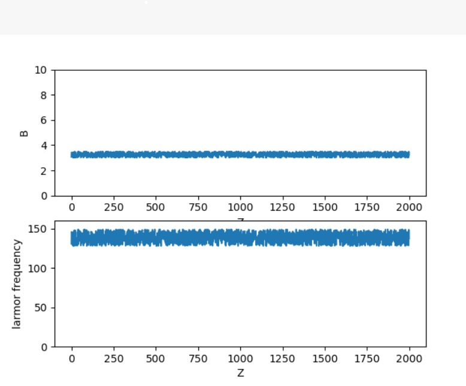

# **Bloch Equation Simulator**

                                    Team Members 
                    
                    Asmaa Mahmoud               SEC: 1 BN: 14
                    
                    Donia Abd El-Salam          SEC: 1 BN: 29
                    
                    Salma Hamza                 SEC: 1 BN: 38
                    
                    Mariam Ahmed                SEC: 2 BN: 29

---
----
## **The First part of the task:** 

---
## **k-Space**:
The k-space is an extension of the concept of Fourier space well known in MR imaging. The k-space represents the spatial frequency information in two or three dimensions of an object. The k-space is defined by the space covered by the phase and frequency encoding data.

The relationship between k-space data and image data is the Fourier transformation. 

Every point in the raw data matrix contains part of the information for the complete image. A point in the raw data matrix does not correspond to a point in the image matrix. The outer rows of the raw data matrix, the high spatial frequencies


---
## **Code Details and Results** 

In This part we take an image and present it in its 2-Dimensional K-Space grayscaled image . 

- ### The transform_image_to_kspace() Function is responsible for converting a regular brain Image to its K-Space form .
- ### This Function take the image and by Fourier  and Inverse Fourier Trasnformation it produce K-Space.
- ### The Kspace Function() is used to take the formed K-Space array and plot it in 2D.

#### Functions of this part in code:

```
    def transform_image_to_kspace(img, dim=None, k_shape=None):
  
        if not dim:
            dim = range(img.ndim)

        k = fft.fftshift(fft.fftn(fft.ifftshift(img, axes=dim), s=None, axes=dim), axes=dim)
        k /= np.sqrt(np.prod(np.take(img.shape, dim)))

        k = np.real(k)
        k = 20*np.log(np.abs(k)+1)
        return(k)

    def KSpace():
        magnitudeSpectrum = transform_image_to_kspace(img)
        plt.subplot(121),plt.imshow(img,cmap='gray')
        plt.title('Original ')
        plt.subplot(122),plt.imshow(magnitudeSpectrum, cmap = 'gray',interpolation='nearest')
        plt.title('K sapce')
        plt.show()

```

## **Results:** 

- Original and K-space images


---------
## **Second part of the task:**


- We created a function to generate a random array of magnetic field "B" so, we can calculate the larmor frequency as the **larmor_frequency = gyromagnetic_ratio * magnetic_field** where, gyromagnetic_ratio = 42.6MHz/T then, we plot them using the **LarmerFreqPlot** function.

```
    def LarmerFreq():

        seed(1)
        for _ in range(0,2000):
            B.append(random()*0.5+3)
        larmor_frequency = 42.6*np.array(B)
        df = larmor_frequency
        return(df)

    def LarmerFreqPlot():
        df = LarmerFreq()
        plt.subplot(211)
        plt.suptitle('B')
        plt.plot(zlam,B)
        plt.xlabel('Z')
        plt.ylabel('B')
        axes = pylab.gca()
        axes.set_ylim(0,10)
        plt.subplot(212)
        plt.plot(zlam,df)
        plt.xlabel('z')
        plt.ylabel('Larmer Freq')
        plt.show()
```
## **Results:** 
- The magnetic_field and difference in angular_frequency between the molecules of water:


--------------
## **Last part:**

we assumed that M  **"Megnitization Vector"**  is [0,0,1] and we rotate it around Y axsis to be [1,0,0] .

- ### We created a function **zrot** to rotate the vector about z direction,and this function is called by 

### **freeprecess** function which calculates A and B matrices .
#### freeprecess arguments:
- Relaxation times “T1” and “T2”
- The duration of free precession “dT” 
- The larmor frequency “df” 


```
        def zrot(phi):   

            Rz = [[np.cos(phi) ,-np.sin(phi), 0],[np.sin(phi) ,np.cos(phi), 0],[ 0, 0 ,1]]
            return(Rz)

     
        def freeprecess(dT ,T1 ,T2 , df):
     
            phi = 2*np.pi*df*dT/1000
            E1 = np.exp(-dT/T1)	
            E2 = np.exp(-dT/T2)        
            Afp = np.dot([[E2,0,0],[0,E2,0],[0,0,E1]],zrot(phi))            
            Bfp = [0 ,0 ,1-E1]        
            return(Afp,Bfp)

```


## **More Details about A and B Matrices**

 -  Mx(t)=Mx(0)exp(-t/T2)  , My(t)=My(0)exp(-t/T2) , Mz(t)= M0+[Mz(0)-M0]exp(-t/T1) , and M(t) = [Mx(t),My(t),Mz(t)]

    So to facilitate the calcualtion M1 = A*M +B 

    where A is 3 x 3 matrix [[exp(-t/T2), 0 , 0],[ 0,exp(-t/T2),0],[ 0,0,exp(-t/T1)]] ,

    M = [ Mx(0), My(0), Mz(0)]  , B = [0,0,M0-exp(-t/T1)] and M0 =1 .


- Then we created the **blockEquation** Function 

```    
    def blochEquation():  
        df = LarmerFreq()
        for i in range(3):
            A,B = freeprecess(dT,T1,T2,df[i+2])
            xdata[i],ydata[i]=Magnetization(A,B)
        plot(xdata,ydata)
```    

- #### Firstly, it calls the freeprecess function to Calculate A and B matrices,then it calls the Magnetizatin function to calculate M at every time .
- **Magnetization** Function

```    
    def Magnetization(A,B):
        M = np.empty((N,3))    
        M[0,:] =np.array([1,0,0])
        for k in range (N-1):
            M[k+1,:] = np.dot(A,M[k,:])+B
        return(M[:,0],M[:,1])
```    


- #### Then we go to the plot function to plot the precession of three magnetization vectors each of different larmor_frequency about the z-axis .


```
    def plot(xdata,ydata):
        ax = pylab.gca(projection='3d')   
        ax.set_xlim(min(xdata[0]), max(xdata[0]))
        ax.set_ylim(min(ydata[0]),max(ydata[0]))
        ax.set_zlim(0, 5)
        for i in range(1,200):
            for j in range(3):
                dataxPlot[j].append(xdata[j][i-1])
                datayPlot[j].append(ydata[j][i-1]) 
                pylab.plot(dataxPlot[j],datayPlot[j],z[:i],color =color[j],linewidth=1.5)
            pylab.draw()
            pylab.pause(1e-117)             
        plt.show() 

```

**Plot Function argument**

- ax used to get the current polar axes on the current figure. and we take it as argument to change the x and y range according to the data which we will plot.


- As we know, we have three 3D plots between EX and EY each of different larmor frequency.


---------
## **Results:** 


- Precession and decaying of MXY components around the Z axis:


